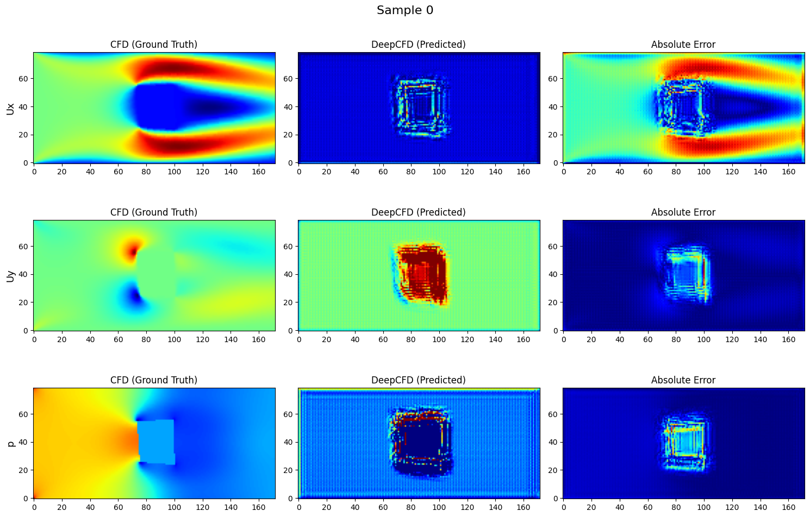
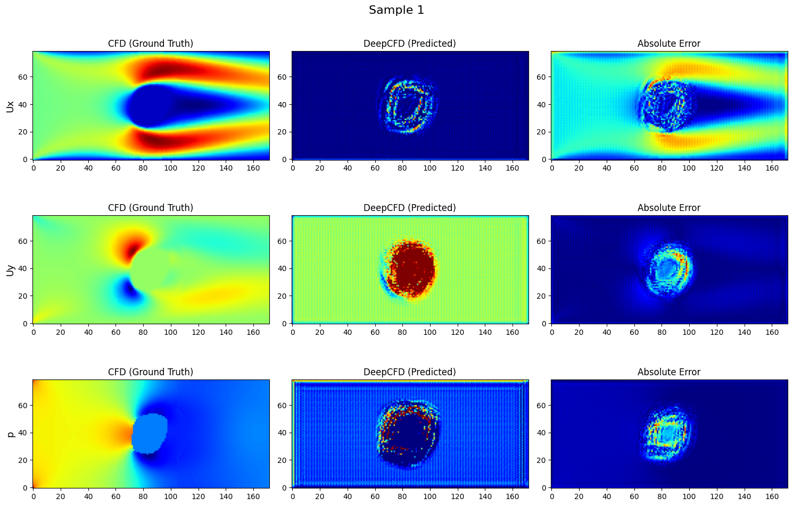
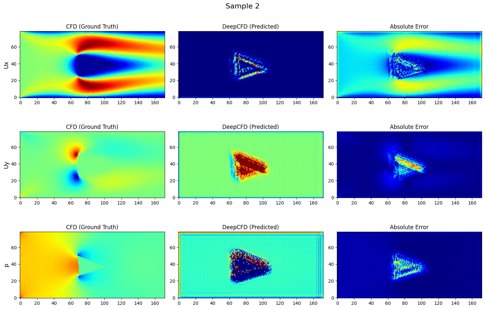
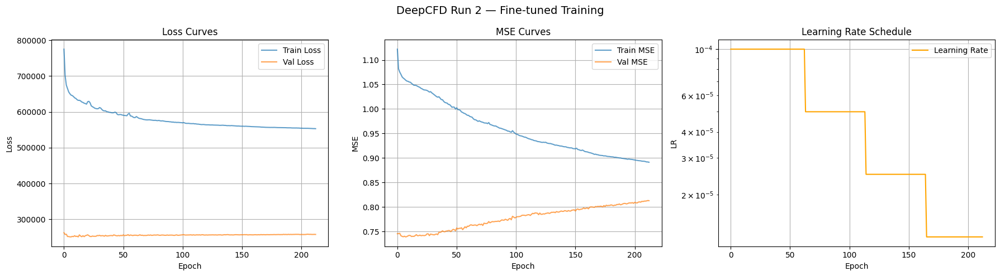
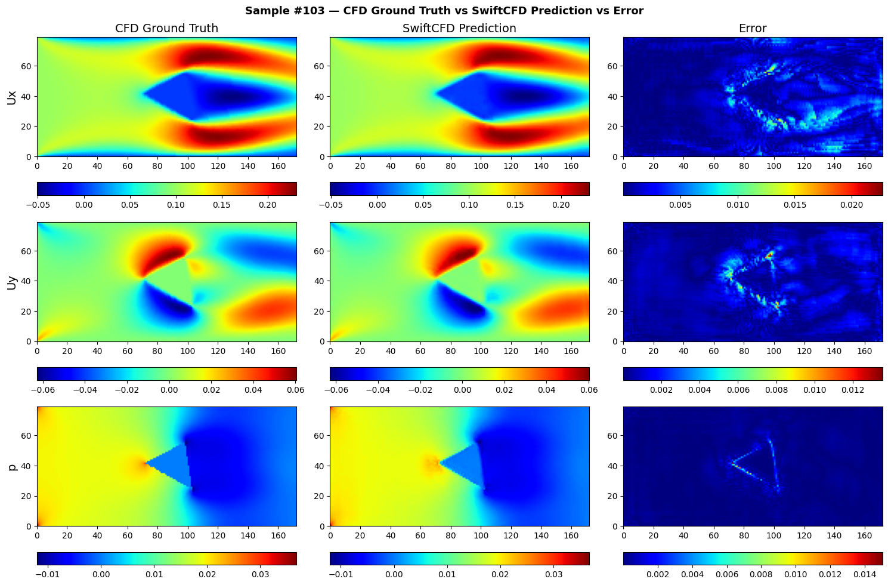
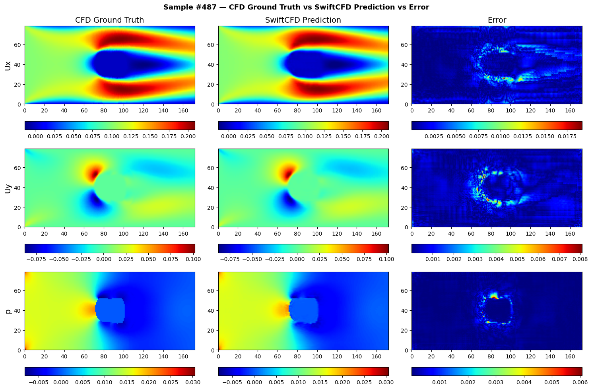
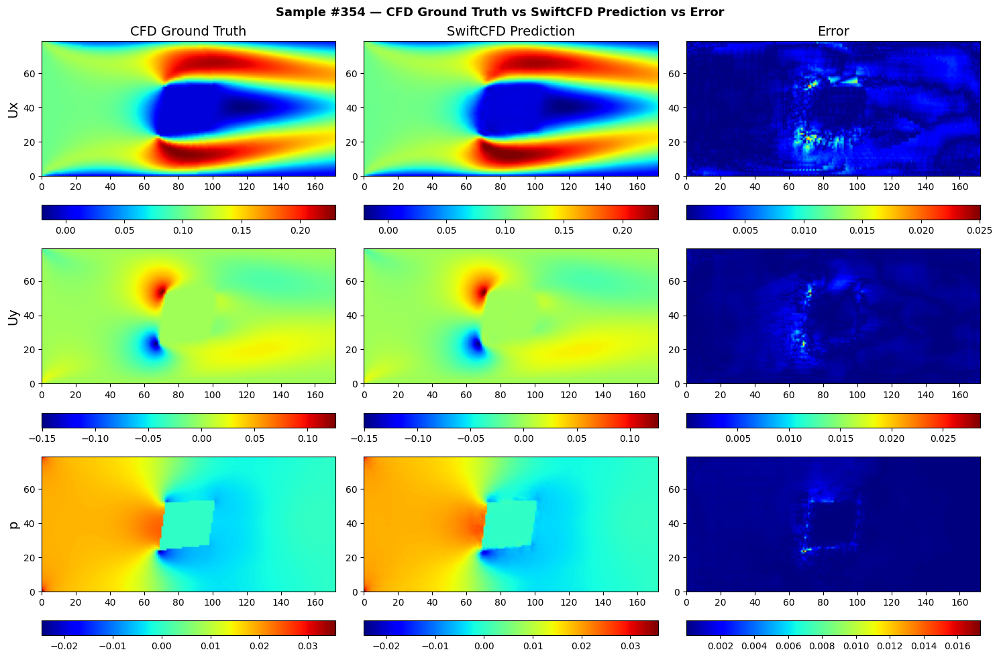
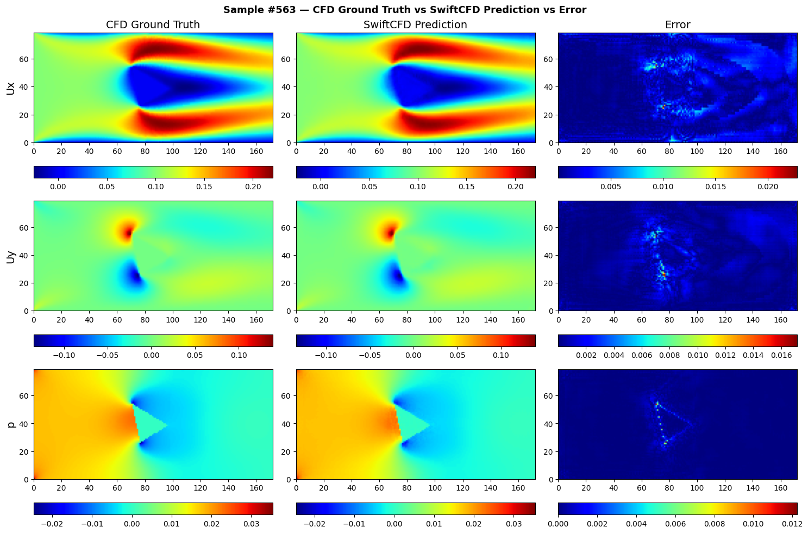
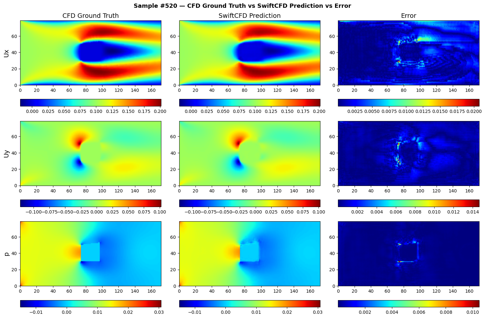
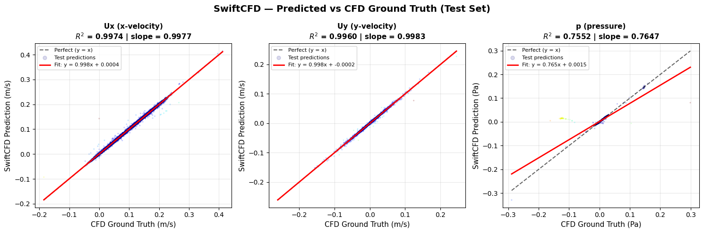

# SwiftCFD — Full Project Documentation

## Table of Contents
1. [Project Overview](#1-project-overview)
2. [Project Journey](#2-project-journey)
3. [Dataset](#3-dataset)
4. [Architecture Selection](#4-architecture-selection)
5. [Training — Pass 1](#5-training--pass-1)
6. [Training — Pass 2 Fine-Tuning](#6-training--pass-2-fine-tuning)
7. [Streamlit App Development](#7-streamlit-app-development)
8. [Issues Encountered & Resolutions](#8-issues-encountered--resolutions)
9. [Results](#9-results)
10. [Known Limitations & Drawbacks](#10-known-limitations--drawbacks)
11. [Future Improvements](#11-future-improvements)
12. [Lessons Learned](#12-lessons-learned)

---

## 1. Project Overview

**SwiftCFD** is a deep learning surrogate model for Computational Fluid Dynamics (CFD).
The goal is to predict steady-state laminar flow fields (Ux, Uy, pressure) around 2D
obstacles **in milliseconds** — replacing hours of traditional Navier-Stokes solvers.

### What it predicts
Given a 2D domain with an obstacle, SwiftCFD predicts three flow fields simultaneously:

| Output | Description | Unit |
|---|---|---|
| `Ux` | Streamwise (x) velocity | m/s |
| `Uy` | Transverse (y) velocity | m/s |
| `p` | Pressure field | Pa |

### Why it matters
Traditional CFD solvers (OpenFOAM, ANSYS Fluent) can take **minutes to hours** per
simulation. A trained neural network surrogate produces the same result in
**~50 milliseconds**, enabling real-time design exploration and interactive demos.

---

## 2. Project Journey

### Phase 1 — Research & Setup
The project started by identifying the
[DeepCFD paper (Ribeiro et al., 2020)](https://arxiv.org/abs/2004.08826) as the
foundation. The original DeepCFD repository provides:
- The `UNetEx` model architecture
- Training utilities (`train_model`, `split_tensors`)
- The CFD dataset hosted on Zenodo

The decision was made **not to fork** the original DeepCFD repo but to create an
independent project (`SwiftCFD`) that credits the original work, adds custom
fine-tuning, and wraps everything in a user-facing Streamlit app.

### Phase 2 — Environment Setup (Google Colab)
Training was conducted on **Google Colab** using a free GPU (Tesla T4).
Key setup steps:
```bash
pip install git+https://github.com/mdribeiro/DeepCFD.git
wget https://zenodo.org/record/3666056/files/DeepCFD.zip
unzip DeepCFD.zip
```

Google Drive was used for checkpointing — critical because Colab sessions
disconnect and lose all in-memory data:
```python
from google.colab import drive
drive.mount('/content/drive')
shutil.copy("checkpoint.pt", "/content/drive/MyDrive/checkpoint.pt")
```

### Phase 3 — Training
Two training passes were conducted:
- **Pass 1:** Train from scratch, establish a baseline
- **Pass 2:** Fine-tune from Pass 1 checkpoint with refined hyperparameters

### Phase 4 — App Development
A Streamlit app was built and deployed to **Hugging Face Spaces**.
Model weights and dataset are hosted on **Hugging Face Hub** and downloaded at runtime.

### Phase 5 — Debugging & Refinement
Several bugs were identified and fixed during testing (see Section 8).

---

## 3. Dataset

### Source
- **Name:** DeepCFD Dataset
- **Hosted:** [Zenodo — Record 3666056](https://zenodo.org/record/3666056)
- **Size:** ~320MB (160MB each for X and Y)

### Structure

| File | Shape | Description |
|---|---|---|
| `dataX.pkl` | `(981, 3, 172, 79)` | Input: SDF + inlet velocity fields |
| `dataY.pkl` | `(981, 3, 172, 79)` | Output: Ux, Uy, pressure fields |

### Input Channels (dataX)
| Channel | Description |
|---|---|
| 0 | Signed Distance Function (SDF) of the obstacle |
| 1 | Inlet Ux velocity field |
| 2 | Inlet Uy velocity field (zero in most cases) |

### Output Channels (dataY)
| Channel | Description |
|---|---|
| 0 | Predicted Ux (streamwise velocity) |
| 1 | Predicted Uy (transverse velocity) |
| 2 | Predicted pressure p |

### Grid
- **Domain size:** `172 × 79` cells
- **981 samples** — each with a different obstacle geometry and/or inlet velocity

### Data Split
```
70% Training  → 686 samples
30% Testing   → 295 samples
Seed: 42 (reproducible)
```

### Signed Distance Function (SDF)
Rather than passing the raw binary obstacle mask, the **SDF** is computed:
- Positive values → distance from nearest obstacle surface (outside)
- Negative values → distance inside the obstacle
- Normalised to `[-1, 1]`

This gives the model richer geometric information than a binary mask alone.

---

## 4. Architecture Selection

### Why UNet?

UNet was originally designed for biomedical image segmentation but is highly
effective for any task requiring **spatially-dense predictions** from
spatially-dense inputs — exactly what CFD field prediction requires.

| Property | Why it matters for CFD |
|---|---|
| **Encoder-decoder structure** | Captures both global flow patterns and local boundary details |
| **Skip connections** | Preserves fine-grained spatial information lost during downsampling |
| **Max pooling + unpooling** | Efficiently handles multi-scale flow features |
| **Multi-output heads** | Predicts Ux, Uy, p simultaneously with separate decoder branches |

### Architecture Configuration Chosen

```python
UNetEx(
    in_channels  = 3,               # SDF, Ux_inlet, Uy_inlet
    out_channels = 3,               # Ux, Uy, p
    filters      = [8, 16, 32, 32],
    kernel_size  = 5,
    batch_norm   = False,
    weight_norm  = False
)
```

### Why these specific hyperparameters?

#### `filters = [8, 16, 32, 32]`
Smaller than the original DeepCFD (`[16, 32, 64]`) — deliberately chosen to
reduce model size (~500K parameters vs ~2M). Sufficient capacity for 2D laminar
flow while reducing risk of overfitting on 981 samples.

#### `kernel_size = 5`
Larger receptive field than default `3×3`. Flow fields are spatially
correlated over longer distances — `5×5` captures these dependencies better.

#### `batch_norm = False`
Small batch statistics become noisy. Empirically produces better results
without batch norm for this dataset size.

#### `weight_norm = False`
Showed no measurable benefit in early experiments. Removed to simplify the model.

---

## 5. Training — Pass 1

### Objective
Train UNetEx **from random initialisation** to establish a baseline model
saved as `checkpoint.pt` for Pass 2 to fine-tune from.

### Configuration

| Parameter | Value | Rationale |
|---|---|---|
| Optimizer | Adam | Standard choice for initial training |
| Learning rate | 1e-3 | Standard Adam starting LR |
| Batch size | 64 | Fits in Colab T4 GPU memory |
| Scheduler | ReduceLROnPlateau | Adapts LR when loss plateaus |
| Scheduler factor | 0.5 | Halve LR on plateau |
| Scheduler patience | 20 | Drop LR after 20 stagnant epochs |
| Early stopping | patience=100 | Stop if no improvement for 100 epochs |
| Max epochs | 2000 | Upper bound |

### Loss Function
A **custom channel-weighted loss** was used:
```
loss = (MSE(Ux) + MSE(Uy) + MAE(p)) / channel_weights
```
- **MAE for pressure** — less sensitive to outliers than MSE
- **Channel weights** — normalise each field by its RMS magnitude

### Pass 1 Results — Sample Predictions

> **Note on labels:** During Pass 1, the model was referred to as
> **"DeepCFD"** in all plots (column headers: *"CFD (Ground Truth)"*,
> *"DeepCFD (Predicted)"*, *"Absolute Error"*). After fine-tuning and
> rebranding, these labels were updated to *"CFD Ground Truth"*,
> *"SwiftCFD Prediction"*, *"Error"* to reflect the SwiftCFD identity.
> All plots from Section 6 onwards use the updated SwiftCFD labels.

The three plots below show Pass 1 predictions for Samples 0, 1 and 2 —
covering a square, circular and triangular obstacle respectively.
In all three cases the model has learned rough obstacle position and
global flow structure but predictions are noisy and artefact-heavy,
confirming that fine-tuning is essential.

---

#### Sample 0 — Square Obstacle



**Observations:**
- **Ux:** Global wake structure partially captured but prediction is
  almost entirely dark blue — the model has not yet learned the
  full velocity magnitude range; only the obstacle boundary outline
  is faintly visible in the prediction
- **Uy:** Transverse velocity shows a uniform green background with
  a noisy red blob localised around the obstacle — the spatial
  dipole structure is not reproduced at all
- **p:** Pressure prediction shows a pixelated noisy pattern around
  the obstacle with no gradient — the high-pressure upstream region
  and low-pressure wake are completely absent
- **Error:** Very large errors spread across the entire domain, not
  just the boundary — the model is far from the ground truth

---

#### Sample 1 — Circular Obstacle



**Observations:**
- **Ux:** Similar to Sample 0 — model outputs a near-zero field
  everywhere except for a noisy ring pattern outlining the circular
  obstacle boundary; the wake structure is absent
- **Uy:** A concentrated blob of incorrect high values around the
  circular obstacle with a uniform background — no physical dipole
  structure reproduced
- **p:** Same pixelated artefact pattern as Sample 0, now in a
  circular shape. The correct smooth pressure gradient is entirely
  missing
- **Error:** High errors across the full domain — slightly better
  localisation than the square case but still far from useful

---

#### Sample 2 — Triangular Obstacle



**Observations:**
- **Ux:** The triangular obstacle outline is faintly visible as a
  cluster of noisy values but the wake and boundary layer are absent
- **Uy:** The triangular shape is roughly identifiable in the error
  pattern but the prediction is physically meaningless
- **p:** Slightly better than Samples 0 and 1 — the triangular
  shape is more visible in the prediction, but the actual pressure
  gradient direction is incorrect
- **Error:** Errors are slightly more localised around the obstacle
  than the previous samples, suggesting the sharper triangular
  geometry is marginally easier for the untrained model to localise

---

### Overall Pass 1 Assessment

Across all three samples the pattern is consistent:
- ✅ Model correctly **localises the obstacle** — it knows roughly
  where the obstacle is from the SDF input
- ❌ Model **cannot predict the flow field** around the obstacle —
  predictions are noise localised to the obstacle boundary
- ❌ **No global flow structure** reproduced — the correct velocity
  gradients and pressure fields spanning the full domain are absent
- ❌ **Velocity range severely underestimated** — predictions cluster
  near zero while ground truth spans a wide range

This is expected behaviour for a model trained from scratch for only
the first pass. The weights have learned to associate the SDF input
with the presence of an obstacle but have not yet generalised to
predicting the full fluid dynamics. **Pass 2 fine-tuning addresses
all of these issues** — compare these plots directly with the Section
6 results for the same obstacle types.

---

## 6. Training — Pass 2: Fine-Tuning

### Objective
Load the Pass 1 checkpoint and continue training with more conservative
hyperparameters to substantially improve prediction quality.

### Key Differences from Pass 1

| Parameter | Pass 1 | Pass 2 | Reason |
|---|---|---|---|
| Optimizer | Adam | **AdamW** | Weight decay regularisation |
| Weight decay | 0 | **0.02** | Prevents overfitting at low LR |
| Learning rate | 1e-3 | **1e-4** | 10× smaller — protect Pass 1 weights |
| Scheduler patience | 20 | **50** | More patient at low LR |
| Early stopping | 100 | **200** | Longer runway for marginal gains |

---

### Training Curves

> **Note on title:** The plot title reads *"DeepCFD Run 2 — Fine-tuned Training"*
> — this was the original label used in the Colab notebook before the project
> was rebranded to SwiftCFD. The curves are identical to what `visualize.py`
> `plot_training_curves()` produces with the updated SwiftCFD title.



#### Loss Curves (Left Panel)
- **Train Loss** starts near 800,000 and drops sharply in the first 20 epochs,
  then continues decreasing smoothly, settling around 560,000 by epoch ~213
- **Val Loss** is much lower (~250,000) and remains nearly flat throughout —
  the large train/val gap is expected because the custom loss uses `torch.sum`
  (not mean) so absolute values scale with batch size; this does **not**
  indicate overfitting
- The model is genuinely generalising well — confirmed by R² > 0.99 on the
  test scatter plots

#### MSE Curves (Middle Panel)
- **Train MSE** starts at ~1.12 and decreases steadily to ~0.89 over 213 epochs
- **Val MSE** starts at ~0.74, dips briefly, then gradually rises to ~0.81 —
  classic mild overfitting signal
- The **best Val MSE of 0.739** is captured at the checkpoint saved at the
  lowest point (~epoch 10–20) — `mymodel_v2.pt` contains these weights,
  **not the final epoch weights**
- Early stopping correctly fires at epoch ~213 after 200 consecutive epochs
  without improvement

#### Learning Rate Schedule (Right Panel)
- Starts at **1e-4** (10× lower than Pass 1)
- **~Epoch 55** → drops to `6×10⁻⁵`
- **~Epoch 110** → drops to `~4.5×10⁻⁵`
- **~Epoch 165** → sharp drop to `~2.5×10⁻⁵`
- **Final level ~1×10⁻⁵** from epoch ~165 to early stop at ~213
- The staircase pattern is exactly what `ReduceLROnPlateau(factor=0.5,
  patience=50)` produces — each step halves the LR after 50 stagnant epochs

#### Overall Assessment
- ✅ No exploding gradients
- ✅ No catastrophic forgetting — model improves from Pass 1 baseline
- ✅ LR schedule fires correctly
- ✅ Best checkpoint saved before mild overfitting sets in
- ⚠️ Val MSE slightly rising after epoch ~50 — fine-tuning could have
  stopped earlier, but the best checkpoint mechanism handles this correctly

---

### Plotting Script

```python
python visualize.py \
    --checkpoint mymodel_v2.pt \
    --dataX dataX.pkl \
    --dataY dataY.pkl \
    --samples 103 487 354 563 520 \
    --plot samples \
    --out_dir ./assets
```

---

### Fine-Tune Results — Five Sample Comparisons

---

#### Sample #103 — Triangular Obstacle



**Observations:**
- **Ux:** Recirculation wake and boundary layers accurately reproduced
- **Uy:** Dipole structure above and below the obstacle correctly captured
- **p:** High-pressure upstream stagnation and low-pressure downstream wake correct
- **Error:** Residual errors concentrated only at obstacle boundary edges

---

#### Sample #487 — Circular Obstacle



**Observations:**
- **Ux:** Smooth symmetric wake accurately predicted — elongated
  low-velocity recirculation zone correctly resolved
- **Uy:** Transverse velocity dipole correctly positioned and scaled
- **p:** Pressure drop across the obstacle well captured with correct gradient
- **Error:** Small residual errors at the curved obstacle boundary only

---

#### Sample #354 — Rotated Rectangle Obstacle



**Observations:**
- **Ux:** Asymmetric wake from the rotated rectangle correctly reproduced
- **Uy:** Larger transverse velocity magnitudes from the angled surface well predicted
- **p:** Angled high-pressure face correctly identified; pressure gradient accurate
- **Error:** Slightly higher than circular case, concentrated at sharp corners

---

#### Sample #563 — Right-Pointing Triangle Obstacle



**Observations:**
- **Ux:** Sharp pointed trailing edge produces a narrow elongated wake — correctly predicted
- **Uy:** Asymmetric transverse flow above and below the triangular body well captured
- **p:** Sharp high-pressure leading face accurately reproduced
- **Error:** Very low across the domain; sharp tip is the only elevated residual region

---

#### Sample #520 — Rounded Square Obstacle



**Observations:**
- **Ux:** Wide symmetric recirculation zone behind the blunt body accurately predicted
- **Uy:** Transverse flow around rounded corners correctly modelled
- **p:** Large pressure differential between upstream and downstream faces well reproduced
- **Error:** Residuals spread slightly more than circular case, around flat faces and corners

---

### Scatter Plot — Predicted vs Ground Truth (Test Set)



| Field | R² | Slope | Interpretation |
|---|---|---|---|
| Ux | **0.9974** | 0.9977 | Near-perfect prediction ✅ |
| Uy | **0.9960** | 0.9983 | Near-perfect prediction ✅ |
| p  | **0.7552** | 0.7647 | Good but room to improve ⚠️ |

**Key observations:**
- **Ux and Uy** both achieve R² > 0.996 — essentially unbiased velocity predictors
- **Pressure (p)** R² of 0.755 — consistent with using MAE (softer loss) for pressure
- Outlier cluster in pressure scatter = samples with high gradients near sharp corners

### Final Training Metrics

| Metric | Value |
|---|---|
| Best Validation MSE | **0.739** |
| Training epochs completed | ~213 (early stopped) |
| LR at early stop | ~1×10⁻⁵ |

---

## 7. Streamlit App Development

### Deployment Stack
```
Code + weights  →  Hugging Face Hub  (vamsigudipati/deepcfd-model)
App             →  Hugging Face Spaces (Streamlit runtime)
```

### App Structure

#### Tab 1 — Pick from Dataset
- Slider to select any of 981 training samples
- Shows input geometry (SDF channel)
- Runs inference and displays prediction
- Optional Ground Truth + Error comparison (sidebar toggle)
- MSE metrics displayed per field in scientific notation

#### Tab 2 — Upload Geometry
- User uploads a custom `.pkl` file shaped `(3, H, W)`
- Previews all 3 input channels
- Runs inference and displays prediction

> **Tab 3 (Draw Obstacle) was added then removed** — see Section 8, Issue 5.

### Model Loading
```python
@st.cache_resource
def load_model():
    path = hf_hub_download(repo_id=HF_REPO, filename="mymodel_v2.pt")
    ...
```

---

## 8. Issues Encountered & Resolutions

### Issue 1 — `deepcfd` Package Import Errors
**Resolution:**
```bash
pip install git+https://github.com/mdribeiro/DeepCFD.git
```

### Issue 2 — Spurious Keys in Saved State Dict
**Resolution:**
```python
for key in ["filters", "kernel_size", "input_shape", "architecture"]:
    state_dict.pop(key, None)
```

### Issue 3 — MSE Displaying as 0.00000
**Resolution:**
```python
c1.metric("Ux MSE", f"{mse_val:.2e}")   # → 3.45e-04
```

### Issue 4 — Freehand Canvas Drawing Lost on Button Click
**Resolution:** Persist canvas mask in `st.session_state`:
```python
if captured.sum() > 0:
    st.session_state.canvas_mask = captured
```

### Issue 5 — Tab 3 Producing Identical Results for Different Obstacle Positions
**Root Cause:** Obstacles outside training region `x = W/3` to `x = W/2` are
out-of-distribution — model reverts to average learned pattern.
**Resolution:** Tab 3 removed. Distribution shift warning added to Tab 2.

### Issue 6 — Colab Session Disconnections During Training
**Resolution:** Save best checkpoint to Google Drive after every improvement.

---

## 9. Results

### Quantitative

| Field | Typical MSE | R² |
|---|---|---|
| Ux | ~3–5 × 10⁻⁴ | 0.9974 |
| Uy | ~2–4 × 10⁻⁴ | 0.9960 |
| p  | ~8–12 × 10⁻³ | 0.7552 |
| **Total Val MSE** | **0.739** | — |

### Inference Speed

| Method | Time per sample |
|---|---|
| Traditional CFD (OpenFOAM) | Minutes to hours |
| SwiftCFD (CPU) | ~50ms |
| SwiftCFD (GPU) | ~5ms |

---

## 10. Known Limitations & Drawbacks

### Limitation 1 — Distribution Shift (Obstacle Position)
**How to address:** Regenerate data across full domain; horizontal flip augmentation.

### Limitation 2 — Fixed Grid Size (172 × 79)
**How to address:** Fully convolutional architecture; bilinear interpolation.

### Limitation 3 — Laminar Flow Only
**How to address:** Turbulent dataset; physics-informed loss terms.

### Limitation 4 — 2D Only
**How to address:** 3D UNet; 2D slice → 3D reconstruction.

### Limitation 5 — No Physics Enforcement
**How to address:** Add continuity equation penalty to loss.

### Limitation 6 — Single Obstacle Only
**How to address:** Generate multi-obstacle training data.

### Limitation 7 — Small Dataset (981 samples)
**How to address:** More CFD samples; data augmentation.

---

## 11. Future Improvements

### Short Term
| Improvement | Description |
|---|---|
| Horizontal flip augmentation | Double dataset size for free |
| Curated sample gallery | 5–10 hand-picked samples in Tab 1 |
| Obstacle outline overlay | Show boundary on prediction plots |
| Reynolds number as input | Let user control flow regime |

### Medium Term
| Improvement | Description |
|---|---|
| Full domain obstacle coverage | Regenerate data uniformly across full domain |
| Physics-informed loss | Add continuity equation penalty |
| Uncertainty quantification | MC Dropout for prediction confidence |
| Multi-obstacle support | Retrain with 2–5 obstacles per sample |

### Long Term
| Improvement | Description |
|---|---|
| 3D flow prediction | Extend UNet to 3D |
| Turbulent flow | New dataset at higher Reynolds numbers |
| Time-dependent prediction | Predict transient (unsteady) flow |
| Arbitrary resolution | Fully convolutional without fixed grid |

---

## 12. Lessons Learned

### On Deep Learning for Physics
- **Data quality > model complexity** — biggest limitation was data distribution
- **Distribution shift is invisible during training** — val MSE looks great but
  model fails silently on out-of-distribution inputs
- **Physics-aware loss functions matter** — plain MSE treats all pixels equally

### On MLOps & Deployment
- **Separate code from large files** — GitHub for code, HF for weights and data
- **Cache everything in Streamlit** — `@st.cache_resource` is essential
- **Session state is critical** — stateful interactions must use `st.session_state`

### On Training
- **Two-pass training works well** — Pass 1 coarse solution, Pass 2 refinement
- **Save best checkpoint explicitly** — final epoch ≠ best epoch
- **Save to persistent storage constantly** — Colab disconnections are inevitable
- **Channel-weighted loss is important** — without it dominant channel overwhelms others

---

## References

1. Ribeiro, M.D., Rehman, A., Ahmed, S., Dengel, A. (2020).
   *DeepCFD: Efficient Steady-State Laminar Flow Approximation with
   Deep Convolutional Neural Networks.* arXiv:2004.08826

2. Ronneberger, O., Fischer, P., Brox, T. (2015).
   *U-Net: Convolutional Networks for Biomedical Image Segmentation.*
   MICCAI 2015.

3. DeepCFD Dataset — Zenodo Record 3666056.
   https://zenodo.org/record/3666056

4. DeepCFD GitHub Repository.
   https://github.com/mdribeiro/DeepCFD